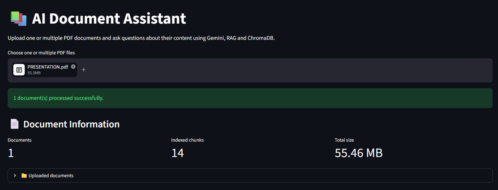
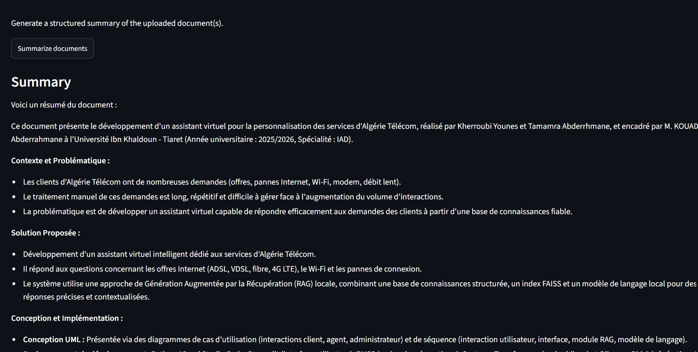
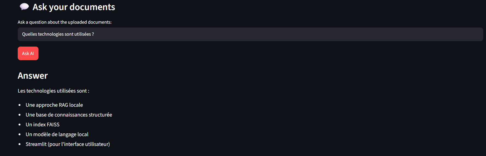

# 📚 AI Document Assistant

An intelligent document assistant built with **Python, Streamlit, Retrieval-Augmented Generation (RAG), ChromaDB, Sentence Transformers, and Google Gemini**.

The application allows users to upload one or multiple PDF documents and ask questions about their content. It retrieves relevant information from the documents and uses Gemini to generate contextual answers based on the retrieved content.

## 🖥️ Application Preview

### PDF Upload & Document Processing



### AI Document Summary



### RAG Question Answering



## 🚀 Features

- Upload one or multiple PDF documents
- Extract text page by page
- Split documents into overlapping chunks
- Preserve metadata such as file name, page number, and chunk ID
- Generate local embeddings using Sentence Transformers
- Store embeddings and document metadata in ChromaDB
- Perform semantic search across uploaded documents
- Generate contextual answers using Google Gemini
- Display source documents and page numbers
- Generate document summaries
- Reduce hallucinations by grounding answers in retrieved document context
- Interactive web interface built with Streamlit

## 🧠 RAG Architecture

```text

PDF Documents

      ↓

PDF Text Extraction

      ↓

Text Chunking

      ↓

Sentence Transformers

(Local Embeddings)

      ↓

ChromaDB

(Vector Database)

      ↓

Semantic Retrieval

      ↓

Relevant Context

      ↓

Google Gemini

      ↓

Answer + Sources

```

## 🛠️ Technologies

- Python
- Streamlit
- Google Gemini
- Google GenAI SDK
- Retrieval-Augmented Generation (RAG)
- Sentence Transformers
- ChromaDB
- PyPDF
- python-dotenv

## 📂 Project Structure

```text

ia_document_assistant/

│

├── core/

│   ├── **init**.py

│   ├── [embeddings.py](http://embeddings.py)

│   ├── [llm.py](http://llm.py)

│   ├── pdf_[loader.py](http://loader.py)

│   ├── rag_[pipeline.py](http://pipeline.py)

│   ├── [retriever.py](http://retriever.py)

│   ├── text_[splitter.py](http://splitter.py)

│   └── vector_[store.py](http://store.py)

│

├── data/

├── prompts/

├── ui/

│

├── .env.example

├── .gitignore

├── [app.py](http://app.py)

├── requirements.txt

└── [README.md](http://README.md)

```

## ⚙️ Installation

### 1. Clone the repository

```bash

git clone [https://github.com/YOUR_USERNAME/ai-document-assistant.git](https://github.com/YOUR_USERNAME/ai-document-assistant.git)

cd ai-document-assistant

```

### 2. Create a virtual environment

```bash

python -m venv venv

```

Activate it on Windows:

```bash

venv\Scripts\activate

```

### 3. Install dependencies

```bash

pip install -r requirements.txt

```

### 4. Configure Gemini API

Create a `.env` file in the root directory:

```env

GEMINI_API_KEY=your_gemini_api_key_here

```

Never publish your real API key on GitHub.

### 5. Run the application

```bash

streamlit run [app.py](http://app.py)

```

## 💡 Example Usage

1. Upload one or multiple PDF documents.
2. Wait for the documents to be processed and indexed.
3. Ask a question about their content.
4. The system searches for relevant passages using semantic retrieval.
5. Gemini generates an answer based on the retrieved context.
6. The application displays the relevant source documents and page numbers.

## 🔐 Security

API keys are stored locally using environment variables.

The `.env` file is excluded from Git using `.gitignore`.

Use `.env.example` as a template and never commit real credentials.

## 📌 Future Improvements

- Conversation history
- Improved document summarization for very large PDFs
- Support for additional document formats
- Improved retrieval and reranking
- Better source citation interface
- Deployment to the cloud

## 👨‍💻 Author

**Younes Kherroubi**

Master's student in Artificial Intelligence interested in LLMs, RAG, NLP, intelligent systems, and AI automation.

- GitHub: [younesdz03]([https://github.com/younesdz03](https://github.com/younesdz03))
- LinkedIn: [Younes Kherroubi]([https://www.linkedin.com/in/younes-kherroubi-aa2127375/](https://www.linkedin.com/in/younes-kherroubi-aa2127375/))

